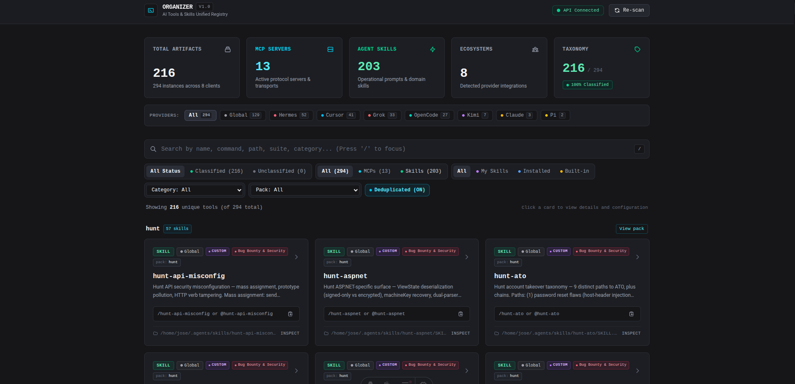

# AI Ecosystem Organizer

A local catalog of **Skills** and **MCP** servers across the AI clients on your machine (Grok, Hermes, OpenCode, Cursor, Claude, Kimi, Pi, and `~/.agents/skills`).

It scans your configs, groups skills into packs (parent + children), and shows how to invoke each tool. Secrets are never stored: only environment variable **keys**.

Organizer is also **agent-facing**: it ships its own skill (`organizer-catalog`) so an AI can configure and operate the catalog, and its own MCP server so the agent can list, inspect, classify, and refresh items without opening the UI.



## Why this exists

Skills and MCP servers do not live in one place. Each client has its own folders and config files (`~/.agents/skills`, `~/.grok`, `~/.cursor`, Hermes, OpenCode, …). After a few installs you have hundreds of tools and no map.

Packs make that worse: `npx skills add owner/repo` flattens a whole GitHub repo into sibling folders. A pack like bug-bounty is one parent plus dozens of `hunt-*` children, but on disk they look unrelated. An agent then has to guess which skill to load from a giant list of descriptions.

Organizer is useful because it:

- **Inventories** every skill and MCP it can find on the machine, including how to invoke it
- **Groups packs** (repo, nested folder, or alias) so a parent shows its children
- **Gives agents a real API** (MCP + skill) instead of hoping they pick the right `SKILL.md` from memory
- **Keeps secrets out of the catalog** (env keys only)

If you only use one client and a handful of skills, you may not need it. It pays off when the same machine has several agents and large skill packs.

## Quick path

1. Install [Go 1.27+](https://go.dev/dl/) and [Bun](https://bun.sh) (Node 22.12+ also works for the frontend).
2. Clone this repo and install frontend deps:

   ```bash
   git clone https://github.com/josegil1909/skill-organizer.git
   cd skill-organizer
   make install
   ```

3. Start API + UI:

   ```bash
   make dev
   ```

4. Open [http://localhost:4321](http://localhost:4321). Keep the backend on [http://localhost:8080](http://localhost:8080) running — without it the UI shows a **sample** catalog, not yours.

## What you get

| Surface | What it does |
|---------|----------------|
| Catalog UI | Search, filter by client / category / pack, inspect invocation |
| Packs | Groups a skills.sh repo, a nested folder (Hermes `skills/erp/…`), or aliases like `bug-bounty` → `hunt-*` |
| Agent skill | `organizer-catalog` tells an AI how to wire MCP, triage unclassified tools, and add taxonomy rules |
| MCP stdio | First-party server: list, inspect, classify, stats, refresh |
| REST API | `GET /api/items`, `/api/stats`, `POST /api/refresh` |

## Agent skill

The repo includes [`.agents/skills/organizer/SKILL.md`](.agents/skills/organizer/SKILL.md) (`name: organizer-catalog`). Copy or symlink that folder into the client's skills directory (for example `~/.agents/skills/organizer` or `.grok/skills/organizer`). Once loaded, an agent can:

- Connect Organizer as an MCP server
- Browse the catalog and explain how to invoke a skill or MCP
- Find unclassified items and add taxonomy rules
- Trigger a rescan after you install new tools

You do not need the UI open for that path. The skill is the playbook; the MCP is the API the agent calls.

## MCP server

After `make build`, point any MCP client at the binary (stdio):

```json
{
  "mcpServers": {
    "organizer": {
      "command": "/absolute/path/to/organizer/bin/organizer-backend",
      "args": ["mcp"]
    }
  }
}
```

From a clone, without installing the binary:

```bash
go run ./backend mcp
```

Tools the server exposes: `organizer_list_items`, `organizer_get_item`, `organizer_get_unclassified`, `organizer_add_taxonomy_rule`, `organizer_get_stats`, `organizer_refresh`. Full argument lists are in the skill file.

## Production build

```bash
make build
```

- Binary: `bin/organizer-backend` (HTTP on `:8080`, or `mcp` for stdio)
- Static UI: `frontend/dist/` (still talks to `http://localhost:8080`)

Override the API port with `PORT=8081 make dev` is not wired in Make; set `PORT` when running the backend directly: `PORT=8081 go run ./backend`.

## Security

- Bind is local. Do not expose `:8080` or `:4321` to the internet.
- The scanner records env **keys** only, never values.
- Taxonomy rules you add persist under `~/.config/organizer/taxonomy.json`.

## License

MIT. See [LICENSE](LICENSE).
